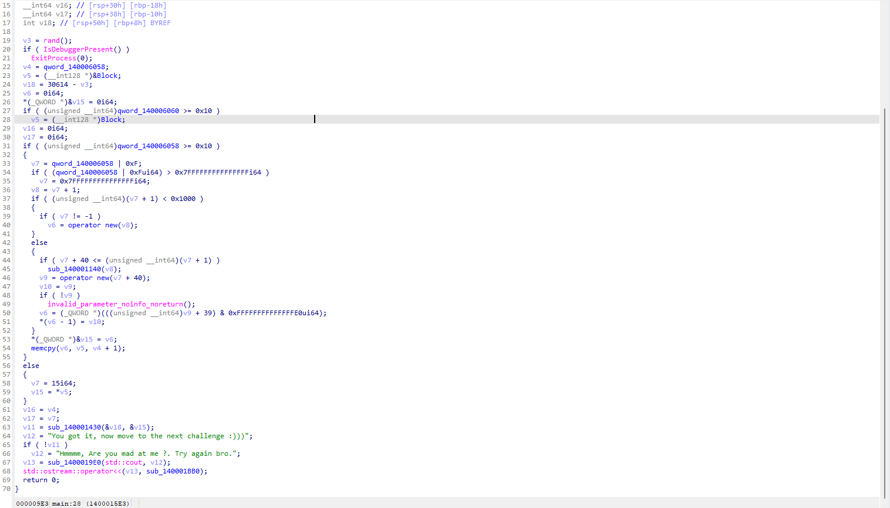
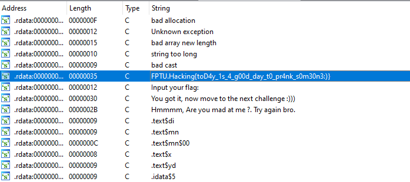
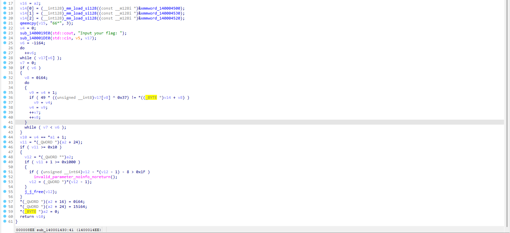
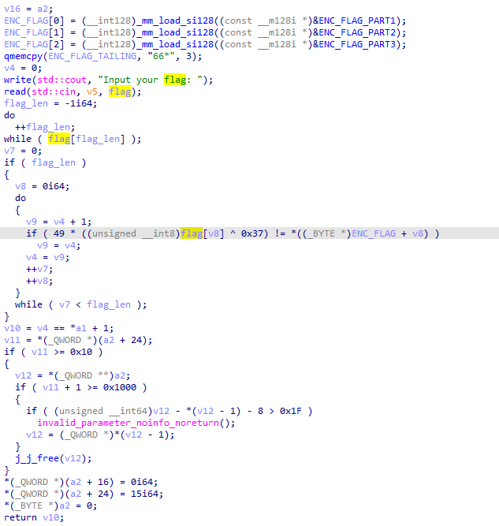

# RE00

Ở bài này chúng ta có 1 file execution là hello.exe  
Mình sử dụng IDA PRO để phân tích file này, mình sử dụng chức năng generate pseudo-code của IDA để đọc cho dễ hiểu:  



Chúng ta được một mớ code phức tạp, mình thấy có gọi IsDebuggerPresent nên đoán chắc đoạn này có 2 trường hợp:  
- Đoạn này dùng để anti debug và ngăn thí sinh đi đường tắt.
- Hoặc đoạn đó dùng để decrypt flag trong bộ nhớ.

Tạm thời mình sẽ thiên về trường hợp 1 hơn, và bỏ qua đống code đó. Nhấn SHIFT + F12 để scan tất cả string trong file, tình cờ mình thấy 1 chú lừa :)



Mình thấy mùi lừa và đọc flag thấy sai format `FPTUHacking{...}` nên đã không submit.  

Mình thường sẽ tìm string kiểu in flag ra, và trong trường hợp này nó là `"You got it, now move to the next challenge :)))"`. Vậy nên mình click vào đó và jump đến những vị trí sử dụng string này. Nhấn X để sử dụng `Jump to xref to operand...` và chỉ có đúng 1 vị trí sử dụng string này.


Nhấn vào đó và nó đưa mình quay trở lại hàm main. Mình thấy biến duy nhất có thể làm thay đổi kết quả đáng lẽ phải in ra là v11, và giá trị cuối cùng mà v11 được gán là từ hàm `sub_140001430`.


Giờ mình sẽ đi sâu vào `sub_140001430`: 



Đọc qua mình đã thấy hàm này thực hiện nôm na như sau:  
- load 1 mớ nào đó, tầm 3 lần 128 bit = 48, lại thêm 3 kí tự đằng sau write vào ngay `v15` phía sau `v14`. Tổng là 41 kí tự. Đến đây là mình nghi nghi đoạn này có liên quan gì đó đến FLAG rồi.
- bảo mình `Input your flag: `.
- xong đoạn sau chạy 1 vòng lặp gì đó rất rối, và cái kết quả là `v10` thì bị ảnh hưởng bởi việc:
    ```
    v4 == *a1 + 1
    ```
    mà `v4` bị thay đổi giá trị trong vòng lặp trước đó. Nên để in được ra thông báo tích cực thì hàm này phải trả về TRUE, tức `v4` sẽ phải bằng `*a1 + 1`. Đây chắc chắn là check flag thí sinh nhập có thỏa mãn hay không rồi.

    => `Giờ mình sẽ tập trung dịch lại hàm này.`

Trong lúc refactor để dễ đọc hơn thì mình thấy đoạn này:



```
if ( 49 * ((unsigned __int8)flag[v8] ^ 0x37) != *((_BYTE *)ENC_FLAG + v8) )
```

Có vẻ đoạn này mà sai 1 phát thì check đi luôn, nên là mình quyết định test thử qua python, vì mình biết format flag nên mình test thử với chữ F đầu tiên.

```Python
print(hex(((ord('F') ^ 0x37) * 49) & 0xFF))

Result: '0xa1'
```

Kết quả là `A1` trùng với byte đầu tiên của `ENC_FLAG_PART1`. Không còn gì nghi ngờ nữa rồi, giờ mình chỉ cần brute-force từng char để ra flag là được. Và đây là code mình dùng để brute-force:

```Python
ENC_FLAG = [
    0xA1, 0xB7, 0xF3, 0xC2, 0x4F, 0x76, 0x14, 0x9C, 0xFE, 0x09, 0x50, 0x8C, 0x60, 0xB2, 0x6B, 0x14,
    0xD8, 0x3A, 0xB2, 0xE8, 0xD3, 0xD8, 0xE8, 0xD3, 0x2F, 0xB2, 0xE8, 0x81, 0xFE, 0x35, 0x04, 0xD3,
    0xE8, 0xB2, 0x76, 0x04, 0xEE, 0xE8, 0x55, 0xD2, 0xE8, 0x14, 0x2F, 0x76, 0x6B, 0x6B, 0xE8, 0x36,
    0x36, 0x36, 0x2A # đoạn này là do memset(v15, "66*", 3) mà thành; ord('6') = 0x36, ord('*') = 0x2A
]

flag=""

while len(flag) < len(ENC_FLAG):
    for x in range(32, 127):
        if((x ^ 0x37) * 49) & 0xFF == ENC_FLAG[len(flag)]:
            flag += chr(x)
            print(chr(x), end="")
            break
```

Kết quả: `FPTUHacking{Welcome_to_the_first_easy_RE_chall_!!!}`
