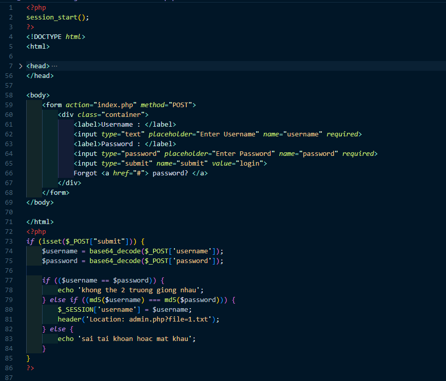
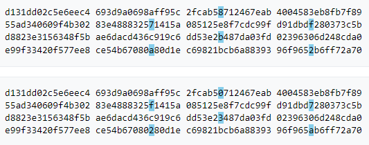
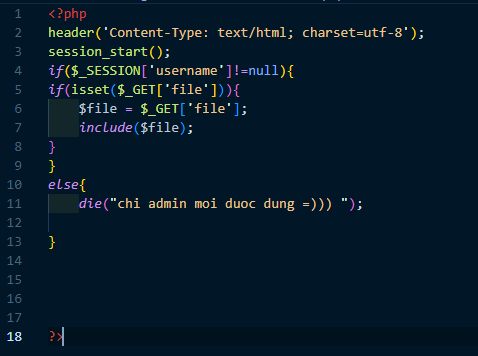
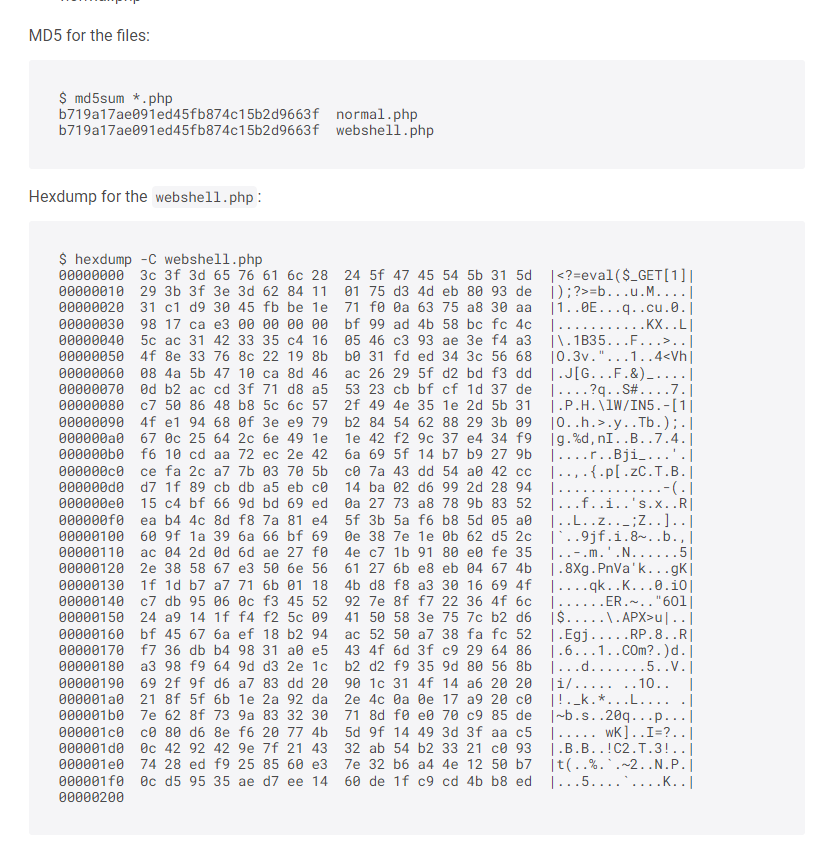

# Magik Hash

## Description
Đây là 1 bài hay, từ người anh không bao giờ lừa `tungdlm`. Mình làm được 1 phần trong lúc thi, và giải tiếp khi về nhà. Thoạt nhìn thì là 1 bài type juggling của php bình thường, tuy nhiên, đấy là cách nhìn nhận sai, cụ thể như thế nào thì mời đọc solution phía dưới. Một lần nữa, anh Tùng lại cho mình 1 mồm hành với `5` bài web trong 7 tiếng :v

[Source code](Source)

[Link challenge (sẽ đóng sau 2 tuần)](34.80.117.212:9005)

## Solution
- Challenge bắt đầu bằng màn hình như dưới: 

- Bài cho sẵn source code của file `index.php` 

- Đọc source thì ta thấy, để đăng nhập vào hệ thống, thì ta sẽ nhập username và password, rồi server sẽ decode bằng base64 cả username và password. Sau đó, phần username và password đã được base64_decode, sẽ được đưa qua 1 hàm hash md5() rồi so sánh cả 2 hash. 
- Điểm đặc biệt là bài yêu cầu `$username` và `$password` phải khác nhau (loose comparison), tuy nhiên, hash md5 của chúng phải giống nhau (strict comparison). Nếu thỏa mãn thì redirect tới `admin.php?file=1.txt`. Mình có thử truy cập khi chưa login thành công, kết quả là có thông báo lỗi. Có lẽ admin.php chặn truy cập bằng session.
- Ban đầu, chú bé đần `shine_102` đoán rằng đây là type juggling, tuy nhiên thế thì lại dễ quá. Vì parameter gửi lên server đều phải để dưới dạng base64 rồi decode ngược lại, nên các trick bypass như gửi parameter là 1 array, hoặc để null đều vô hiệu. Vì thế, mình đã nghĩ tới md5 hash collision. 
- Ban đầu, mình sử dụng hash có sẵn từ trang [wiki](https://en.wikipedia.org/wiki/MD5), rồi sử dụng cyberchef để lấy base64 encode rồi gửi lên server. Tất nhiên là thành công.

- Khi login thành công, chúng ta sẽ được forward tới `http://34.80.117.212:9005/admin.php?file=1.txt`, và nhận được 1 response khá trêu tức

- Đây chắc chắn là lỗi lfi (local file inclusion), vấn đề là tên file flag như thế nào thì không ai biết. Stuck, mình cố gắng dump thử source code của file `admin.php` để xem có gì đặc biệt không bằng payload: `http://34.80.117.212:9005/admin.php?file=php://filter/convert.base64-encode/resource=admin.php`. Base64 decode và chúng ta có [admin.php](Source/admin.php)

- Phân tích 1 chút thì đúng như mình dự đoán, để sử dụng file inclusion, cần phải có `session['username']`, thỏa mãn khi login thành công. Lúc đó, server sẽ `include()` file theo tên mình để ở get parameter 'file'. Hàm `include()` có đặc điểm là sẽ lấy toàn bộ code ở file đấy, vào file hiện tại, tức là nếu trong file mình include có code php, nó cũng sẽ được thực thi khi mình request. Vì vậy, để lấy file content thì thường chúng ta cần base64 encode nó như payload lấy `admin.php`.

- Quay lại với việc lấy thông tin các file ở vị trí hiện tại, mình có nhớ ra là /proc/self/ là 1 file chứa thông tin của process hiện tại, với self giúp chỉ hướng tới process hiện tại mà không cần process id. Vậy nên mình đã thử rất nhiều payload include() với /proc/self. 

- Cuối cùng, mình tìm được 1 payload có vẻ khả dĩ `/proc/self/fd/{fid}`. Với `fid` là số từ 1. Thử brute force thì đề hôm nay về `11`. Với payload:  `http://34.80.117.212:9005/admin.php?file=/proc/self/fd/11`, chúng ta có 1 response khả nghi

- Mình đoán đây chính là file session. với username chính là username mình nhập vào. Tuy nhiên, tới đây mình lại stuck tới hết giải, dù đã làm ra tới bước này từ trưa. 
- Quay trở lại với file này. Nếu đây là file session, mình đã tiếp tục research trên mạng và tìm được bài viết liên quan tới lfi, rce và session. [link](https://www.rcesecurity.com/2017/08/from-lfi-to-rce-via-php-sessions/)
- Lúc tìm được, 1 phần vì không chắc chắn với hướng đi, 1 phần vì cố gắng tự tạo 1 file shell php có md5 hash collision có vẻ bất khả thi với mình, nên mình đã dừng việc tìm kiếm lại. Tuy nhiên, đáp án lại nằm ở việc research. Chỉ vài phút search, chúng ta đã có 2 file php với hash md5 collision, 1 file trong số đó là php shell. [link](https://gitmemories.com/phith0n/collision-webshell). Dựa theo thời điểm mình viết wu, file được up 20 tiếng trước, có vẻ đây là do btc tạo ra.

- Lặp lại trình tự ban đầu, chúng ta có 1 shell trên server khi inject shell vào parameter username. Công việc tiếp theo là khá đơn giản, đây là 1 shell eval(), mình lần lượt list tất cả các file trong thư mục /var/www/html, và tìm file flag là: `easiest_flag_of_my_file.txt`

- Flag: `FUSec{Free_Fire_Flag?}`

